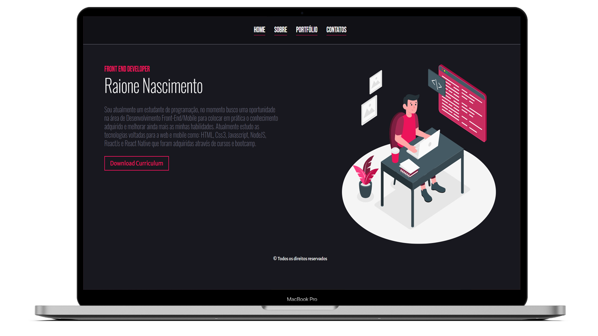

<h1 align="center">
    
</h1>

<h3 align="center">
  Portfólio de Apresentação Simples
  
</h3>

<p align=center>
    “Sua única limitação é você mesmo!”</p>

<br>

<p align="center">

  <a href="https://raionenascimento.com.br">
    
  </a>

  <a href="LICENSE" >
    
  </a>

<br> 
<br>



</p>

## 💼 Objetivo

Esse Projeto foi criado em HTML e CSS contendo as abas: Home, Sobre, Portfólio e Contato. O Objetivo desse portfólio é criar um conjunto organizado de trabalhos produzidos por você (desenvolvedor) ao longo de determinado período. Ela deve reunir as atividades que você considera relevantes para o mercado de trabalho.

<br>


### ***Clone***
```sh
# Clonando a aplicação web:
$ git clone https://github.com/RaioneNascimento/portfolio-simples.git
```

<br>

### ***Instalando Dependencias***

```sh
# Com o terminal execute:
$ cd portfolio-simples

# Depois o comando:
$ npm install
```

<br>

### ***Iniciando a aplicação Web***

```sh
# Executando a aplicação web:
$ yarn start ou npm start
```

<br>

### 🧰 **Utilitários**

  - Editor: **[Visual Studio Code](http://code.visualstudio.com/download)** 
  - Fontes: **[Bebas](https://fonts.google.com/specimen/Bebas+Neue?preview.text_type=custom)**, **[Merriwather](https://fonts.google.com/specimen/Merriweather?preview.text_type=custom)** e **[Oswald](https://fonts.google.com/specimen/Oswald?preview.text_type=custom)**.


<br>

## 📝 Licença

Esse projeto está sob a licença MIT. Veja o arquivo [LICENSE](../LICENSE) para mais detalhes.

Se você ainda não tem um porftólio, pode utilizar esse como base, faça o download conforme o tutorial acima. Apenas modifique os nomes das classes e as imagens para não ficar igual.

---
<p align=center>
  <b>Gostou do projeto?</b> Me ajude deixando uma estrela, assim me insentiva ainda mais nos estudos 🤓
</p>

Feito com :purple_heart: by [raionedeveloper](https://raionenascimento.com.br)
