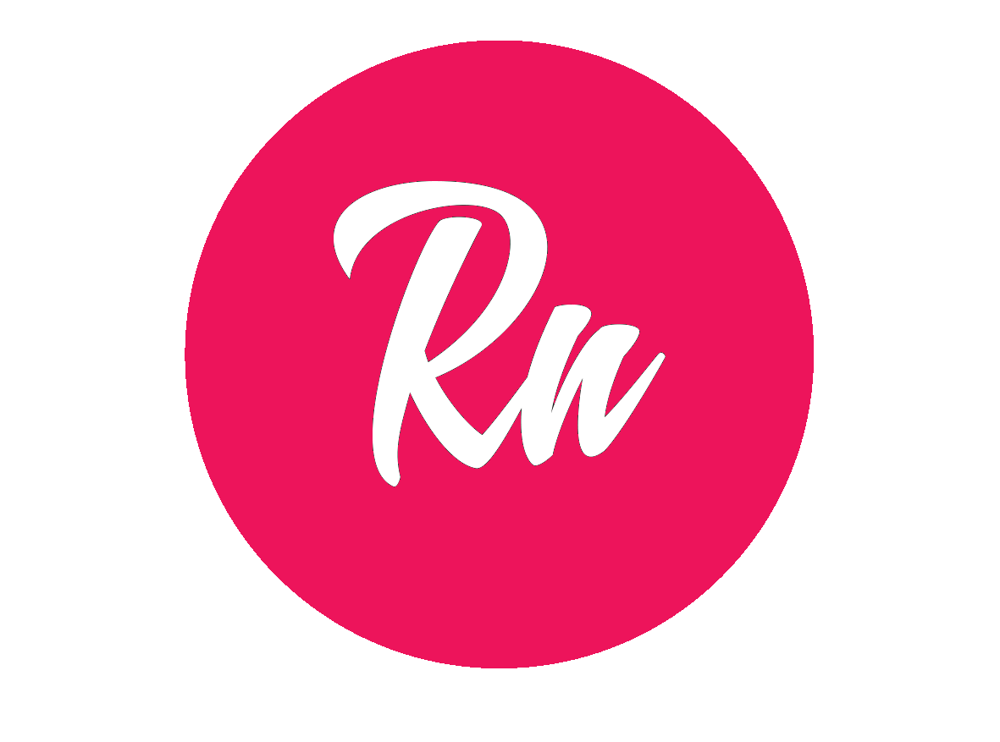

<h1 align="center">
    
</h1>

<h3 align="center">
  Portfólio de Apresentação Simples  
  
</h3>

<blockquote align="center">“Sua única limitação é você mesmo!”</blockquote>

  

  

## :rocket: Portfólio

Projeto criado em HTML e CSS com quatro abas: Home, Sobre, Portfólio e Contato.

## :memo: Licença

Esse projeto está sob a licença MIT. Veja o arquivo [LICENSE](../LICENSE) para mais detalhes.

---

Feito com :purple_heart: by [raionedeveloper](https://raionenascimento.com.br)